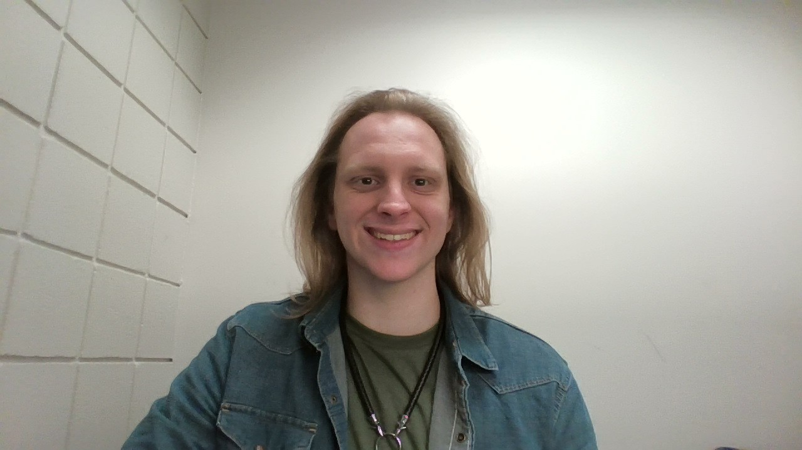

{: style="border-radius: 50%; width: 150px;" }

# John Bumann  
**Cybersecurity Student**  
Pensacola, FL  

[Download Resume](assets\Resume.pdf)  

## Technical Skills
- Networking
- Python
- Linux
- Cybersecurity Tools (Wireshark, Nessus)
- Microsoft Office
- Windows Server

## Education
- **Bachelor of Science in Cybersecurity**  
  University of West Florida, Pensacola, FL _(Expected May 2027)_  
- **Associate of Arts in Computer Science**  
  Pensacola State College, Pensacola, FL _(May 2024)_  

## Work Experience
### Sales Store Checker @ Defense Commissary Agency, Pensacola, FL _(Feb 2024 - Jan 2025)_
- Operates electronic checkout systems and provides customer support.
- Assists with troubleshooting self-checkout systems.
- Prepares reports by counting and verifying cash.

### VR Ambassador @ Vr Adventure Zone, Pensacola, FL _(Jan 2023 - Feb 2024)_
- Maintained cash machines, ensuring proper coin and cash availability.
- Provided technical support to customers for VR and computer systems.
- Assisted customers with safety and usage of VR technology.

## Projects
(Coming soon...)
